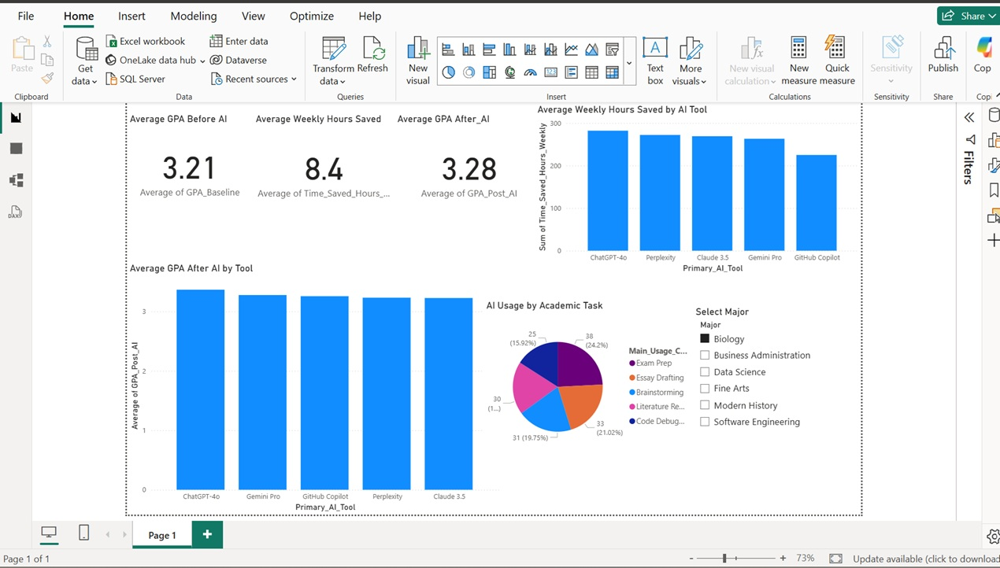

# AI Student Dashboard

## Project Overview

This project analyzes the impact of Artificial Intelligence tools on student academic performance, productivity, and time management.

Using a dataset of student AI usage, the project explores how different AI tools affect GPA improvement, weekly time savings, study habits, and career confidence.

---

## Dataset

Dataset: AI Impact Student Life 2026

Main fields analyzed:

- Age
- Major
- Primary AI Tool
- Main Usage Case
- GPA Baseline
- GPA Post AI
- Time Saved Hours Weekly
- Task Frequency Daily
- AI Ethics Concern
- Career Confidence Score

---

## Technologies Used

- Python
- Pandas
- Matplotlib
- Git
- GitHub
- HTML
- Data Analysis

---

## Research Questions

### Univariate Analysis

1. What is the age distribution of students?
2. Which majors are most represented?
3. What are the most popular AI tools?
4. What are the main AI usage cases?
5. What are the levels of AI ethics concern?
6. How confident are students about their careers?
7. How frequently do students use AI daily?

### GPA Analysis

8. Average GPA before AI
9. Average GPA after AI
10. GPA improvement after AI adoption
11. GPA distribution before AI
12. GPA distribution after AI

### Time Saved Analysis

13. Average weekly time saved
14. Maximum time saved
15. Minimum time saved
16. Distribution of weekly time savings

### AI Tool Comparison

17. Which AI tool provides the highest GPA improvement?
18. Which AI tool saves the most time?
19. Comparison of AI tools by GPA improvement and time savings

### Major Analysis

20. Which majors benefit most from AI in GPA improvement?
21. Which majors save the most time using AI?

### Correlation Analysis

22. Relationship between time saved and GPA improvement

### Behavioral Analysis

23. Does higher daily AI usage lead to higher GPA improvement?
24. Does higher daily AI usage lead to more time savings?
25. Relationship between AI ethics concerns and GPA improvement
26. Relationship between career confidence and GPA improvement

---

## Key Findings

- AI usage increased average GPA.
- Different AI tools produced different academic outcomes.
- Perplexity showed the highest average weekly time savings.
- GPA improvement varied across majors.
- Time saved and GPA improvement showed a weak positive correlation.
- Students using AI more frequently generally reported higher productivity.

---

## Project Structure

```
AI-Student-Dashboard/
│
├── analysis.py
├── app.py
├── AI_Impact_Student_Life_2026.csv
├── index.html
├── server.js
├── Comparison.html
├── timesaved-vs-gpa.html
└── tool vs gpa.html
```

---
## Power BI Dashboard


## Author

Elnaz Jowkar

Data Analytics Portfolio Project
